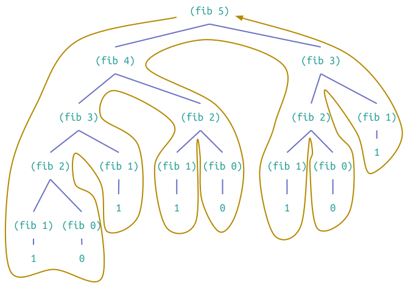

##[1.2  Procedures and the Processes They Generate](contents.html#sec_1.2)

We have now considered the elements of programming: We have used primitive
arithmetic operations, we have combined these operations, and we have
abstracted these composite operations by defining them as compound procedures.
But that is not enough to enable us to say that we know how to program. Our
situation is analogous to that of someone who has learned the rules for how
the pieces move in chess but knows nothing of typical openings, tactics, or
strategy. Like the novice chess player, we don't yet know the common patterns
of usage in the domain. We lack the knowledge of which moves are worth making
(which procedures are worth defining). We lack the experience to predict the
consequences of making a move (executing a procedure).

The ability to visualize the consequences of the actions under consideration
is crucial to becoming an expert programmer, just as it is in any synthetic,
creative activity. In becoming an expert photographer, for example, one must
learn how to look at a scene and know how dark each region will appear on a
print for each possible choice of exposure and development conditions. Only
then can one reason backward, planning framing, lighting, exposure, and
development to obtain the desired effects. So it is with programming, where we
are planning the course of action to be taken by a process and where we
control the process by means of a program. To become experts, we must learn to
visualize the processes generated by various types of procedures. Only after
we have developed such a skill can we learn to reliably construct programs
that exhibit the desired behavior.

A procedure is a pattern for the _local evolution_ of a computational process.
It specifies how each stage of the process is built upon the previous stage.
We would like to be able to make statements about the overall, or _global_,
behavior of a process whose local evolution has been specified by a procedure.
This is very difficult to do in general, but we can at least try to describe
some typical patterns of process evolution.

In this section we will examine some common "shapes" for processes generated
by simple procedures. We will also investigate the rates at which these
processes consume the important computational resources of time and space. The
procedures we will consider are very simple. Their role is like that played by
test patterns in photography: as oversimplified prototypical patterns, rather
than practical examples in their own right.

### [1.2.1  Linear Recursion and Iteration](contents.html#sec_1.2.1)

{{ 1.2.1.1.clj }}

**Figure 1.3:**  A linear recursive process for computing 6!.

We begin by considering the factorial function, defined by

\\( n! = n \cdot (n-1) \cdot (n-2) \cdots 3 \cdot 2 \cdot1 \\)

There are many ways to compute factorials. One way is to make use of the
observation that _n_! is equal to _n_ times (_n_ \- 1)! for any positive
integer _n_:

\\( n! = 
    n \cdot \left [  (n-1) \cdot (n-2)\cdots 3\cdot2\cdot1 \right ] = 
    n \cdot (n-1)! \\)

Thus, we can compute _n_! by computing (_n_ \- 1)! and multiplying the result
by _n_. If we add the stipulation that 1! is equal to 1, this observation
translates directly into a procedure:

{{ 1.2.1.2.clj }}

We can use the substitution model of section
[1.1.5](10.html#sec_1.1.5) to watch this procedure in action
computing 6!, as shown in figure 1.3.

Now let's take a different perspective on computing factorials. We could
describe a rule for computing _n_! by specifying that we first multiply 1 by
2, then multiply the result by 3, then by 4, and so on until we reach _n_.
More formally, we maintain a running product, together with a counter that
counts from 1 up to _n_. We can describe the computation by saying that the
counter and the product simultaneously change from one step to the next
according to the rule

\\[ \begin{array}{l}
    \text{product}\leftarrow \text{counter} \cdot \text{product}
    \\\\ 
    \text{counter} \leftarrow \text{counter} + 1
    \end{array} \\]

and stipulating that _n_! is the value of the product when the counter exceeds
_n_.

{{ 1.2.1.3.clj }}

**Figure 1.4:**  A linear iterative process for computing 6!.

Once again, we can recast our description as a procedure for computing
factorials:[^fn-29]

{{ 1.2.1.4.clj }}

As before, we can use the substitution model to visualize the process of
computing 6!, as shown in figure 1.4.

Compare the two processes. From one point of view, they seem hardly different
at all. Both compute the same mathematical function on the same domain, and
each requires a number of steps proportional to _n_ to compute _n_!. Indeed,
both processes even carry out the same sequence of multiplications, obtaining
the same sequence of partial products. On the other hand, when we consider the
"shapes" of the two processes, we find that they evolve quite differently.

Consider the first process. The substitution model reveals a shape of
expansion followed by contraction. The expansion occurs as the process builds
up a chain of _deferred operations_ (in this case, a chain of multiplications). 
The contraction occurs as the operations are actually performed. This type of
process, characterized by a chain of deferred operations, is called a _recursive
process_. Carrying out this process requires that the interpreter keep track of the
operations to be performed later on. In the computation of _n_!, the length of the
chain of deferred multiplications, and hence the amount of information needed to 
keep track of it, grows linearly with _n_ (is proportional to _n_), just like the
number of steps. Such a process is called a _linear recursive process_.

By contrast, the second process does not grow and shrink. At each step, all we
need to keep track of, for any _n_, are the current values of the variables
`product`, `counter`, and `max-count`. We call this an _iterative process_. In
general, an iterative process is one whose state can be summarized by a fixed
number of _state variables_, together with a fixed rule that describes how the
state variables should be updated as the process moves from state to state and
an (optional) end test that specifies conditions under which the process
should terminate. In computing _n_!, the number of steps required grows
linearly with _n_. Such a process is called a _linear iterative process_.

The contrast between the two processes can be seen in another way. In the
iterative case, the program variables provide a complete description of the
state of the process at any point. If we stopped the computation between
steps, all we would need to do to resume the computation is to supply the
interpreter with the values of the three program variables. Not so with the
recursive process. In this case there is some additional "hidden"
information, maintained by the interpreter and not contained in the program
variables, which indicates "where the process is" in negotiating the chain
of deferred operations. The longer the chain, the more information must be
maintained.[^fn-30]

In contrasting iteration and recursion, we must be careful not to confuse the
notion of a recursive _process_ with the notion of a recursive _procedure_.
When we describe a procedure as recursive, we are referring to the syntactic
fact that the procedure definition refers (either directly or indirectly) to
the procedure itself. But when we describe a process as following a pattern
that is, say, linearly recursive, we are speaking about how the process
evolves, not about the syntax of how a procedure is written. It may seem
disturbing that we refer to a recursive procedure such as `fact-iter` as
generating an iterative process. However, the process really is iterative: Its
state is captured completely by its three state variables, and an interpreter
need keep track of only three variables in order to execute the process.

One reason that the distinction between process and procedure may be confusing
is that most implementations of common languages (including Ada, Pascal, and
C) are designed in such a way that the interpretation of any recursive
procedure consumes an amount of memory that grows with the number of procedure
calls, even when the process described is, in principle, iterative. As a
consequence, these languages can describe iterative processes only by
resorting to special-purpose "looping constructs" such as `do`, `repeat`,
`until`, `for`, and `while`. The implementation of Scheme we shall consider in
chapter 5 does not share this defect. It will execute an iterative process in
constant space, even if the iterative process is described by a recursive
procedure. An implementation with this property is called _tail-recursive_.
With a tail-recursive implementation, iteration can be expressed using the
ordinary procedure call mechanism, so that special iteration constructs are
useful only as syntactic sugar.[^fn-31]

**Exercise 1.9.**  Each of the following two procedures defines a method for adding two positive integers in terms of the procedures `inc`, which increments its argument by 1, and `dec`, which decrements its argument by 1.

{{ 1.2.1.5.clj }}

Using the substitution model, illustrate the process generated by each
procedure in evaluating `(+ 4 5)`. Are these processes iterative or recursive?

**Exercise 1.10.**  The following procedure computes a mathematical function called Ackermann's function.

{{ 1.2.1.6.clj }}

What are the values of the following expressions?

{{ 1.2.1.7.clj }}

Consider the following procedures, where `A` is the procedure defined above:

{{ 1.2.1.8.clj }}

Give concise mathematical definitions for the functions computed by the
procedures `f`, `g`, and `h` for positive integer values of _n_. For example,
`(k n)` computes \\( 5n^{2} \\).

### [1.2.2  Tree Recursion](contents.html#sec_1.2.2)

Another common pattern of computation is called _tree recursion_. As an
example, consider computing the sequence of Fibonacci numbers, in which each
number is the sum of the preceding two:

\\[ 0, 1, 1, 2, 3, 5, 8, 13, 21, ... \\]

In general, the Fibonacci numbers can be defined by the rule

\\[ Fib(n) = 
\begin{cases}
 0 & \text {if } n = 0 \\\\
 1 & \text{if }  n = 1 \\\\ 
 Fib(n-1) + Fib(n-2) & \text{otherwise} 
\end{cases} \\]

We can immediately translate this definition into a recursive procedure for
computing Fibonacci numbers:

{{ 1.2.2.1.clj }}

**Figure 1.5:**  The tree-recursive process generated in computing `(fib 5)`.

Consider the pattern of this computation. To compute `(fib 5)`, we compute
`(fib 4)` and `(fib 3)`. To compute `(fib 4)`, we compute `(fib 3)` and `(fib
2)`. In general, the evolved process looks like a tree, as shown in figure
1.5. Notice that the branches split into two at each level (except at the
bottom); this reflects the fact that the `fib` procedure calls itself twice
each time it is invoked.

This procedure is instructive as a prototypical tree recursion, but it is a
terrible way to compute Fibonacci numbers because it does so much redundant
computation. Notice in figure 1.5 that the entire computation of `(fib 3)` \--
almost half the work -- is duplicated. In fact, it is not hard to show that
the number of times the procedure will compute `(fib 1)` or `(fib 0)` (the
number of leaves in the above tree, in general) is precisely _Fib_(_n_ \+
1). To get an idea of how bad this is, one can show that the value of
_Fib_(_n_) grows exponentially with _n_. More precisely (see exercise
1.13), _F__i__b_(_n_) is the closest integer to \\( \phi^{n} / \sqrt{5} \\), 
where

\\[ \phi = \frac{1 + \sqrt{5}}{2} \approx 1.6180 \\]

is the _golden ratio_, which satisfies the equation

\\[ \phi^{2} = \phi + 1 \\]

Thus, the process uses a number of steps that grows exponentially with the
input. On the other hand, the space required grows only linearly with the
input, because we need keep track only of which nodes are above us in the tree
at any point in the computation. In general, the number of steps required by a
tree-recursive process will be proportional to the number of nodes in the
tree, while the space required will be proportional to the maximum depth of
the tree.

We can also formulate an iterative process for computing the Fibonacci
numbers. The idea is to use a pair of integers _a_ and _b_, initialized to
_Fib_(1) = 1 and _Fib_(0) = 0, and to repeatedly apply the
simultaneous transformations

\\[ \begin{array}{l}
a & \leftarrow & a+b \\\\
b & \leftarrow & a
\end{array} \\]

It is not hard to show that, after applying this transformation _n_ times, _a_
and _b_ will be equal, respectively, to _Fib_(_n_ \+ 1) and
_Fib_(_n_). Thus, we can compute Fibonacci numbers iteratively using the
procedure

{{ 1.2.2.2.clj }}

This second method for computing _Fib_(_n_) is a linear iteration. The
difference in number of steps required by the two methods -- one linear in
_n_, one growing as fast as _Fib_(_n_) itself -- is enormous, even for
small inputs.

One should not conclude from this that tree-recursive processes are useless.
When we consider processes that operate on hierarchically structured data
rather than numbers, we will find that tree recursion is a natural and
powerful tool.[^fn-32] But even in numerical operations, tree-recursive
processes can be useful in helping us to understand and design programs. For
instance, although the first `fib` procedure is much less efficient than the
second one, it is more straightforward, being little more than a translation 
into Lisp of the definition of the Fibonacci sequence. To formulate the
iterative algorithm required noticing that the computation could be recast as
an iteration with three state variables.

#### [Example: Counting change](book-Z-H-4.html#sec_Temp_52)

It takes only a bit of cleverness to come up with the iterative Fibonacci
algorithm. In contrast, consider the following problem: How many different
ways can we make change of $1.00, given half-dollars, quarters, dimes,
nickels, and pennies? More generally, can we write a procedure to compute the
number of ways to change any given amount of money?

This problem has a simple solution as a recursive procedure. Suppose we think
of the types of coins available as arranged in some order. Then the following
relation holds:

The number of ways to change amount _a_ using _n_ kinds of coins equals

  * the number of ways to change amount _a_ using all but the first kind of coin, plus

  * the number of ways to change amount _a_ \- _d_ using all _n_ kinds of coins, where _d_ is the denomination of the first kind of coin. 

To see why this is true, observe that the ways to make change can be divided
into two groups: those that do not use any of the first kind of coin, and
those that do. Therefore, the total number of ways to make change for some
amount is equal to the number of ways to make change for the amount without
using any of the first kind of coin, plus the number of ways to make change
assuming that we do use the first kind of coin. But the latter number is equal
to the number of ways to make change for the amount that remains after using a
coin of the first kind.

Thus, we can recursively reduce the problem of changing a given amount to the
problem of changing smaller amounts using fewer kinds of coins. Consider this
reduction rule carefully, and convince yourself that we can use it to describe
an algorithm if we specify the following degenerate cases:[^fn-33]

  * If _a_ is exactly 0, we should count that as 1 way to make change.

  * If _a_ is less than 0, we should count that as 0 ways to make change.

  * If _n_ is 0, we should count that as 0 ways to make change. 

We can easily translate this description into a recursive procedure:

{{ 1.2.2.3.clj }}

(The `first-denom` procedure takes as input the number of kinds of
coins available and returns the denomination of the first kind. Here we are
thinking of the coins as arranged in order from largest to smallest, but any
order would do as well.) We can now answer our original question about
changing a dollar:

{{ 1.2.2.4.clj }}

`Count-change` generates a tree-recursive process with redundancies similar to
those in our first implementation of `fib`. (It will take quite a while for
that 292 to be computed.) On the other hand, it is not obvious how to design a
better algorithm for computing the result, and we leave this problem as a
challenge. The observation that a tree-recursive process may be highly
inefficient but often easy to specify and understand has led people to propose
that one could get the best of both worlds by designing a "smart compiler"
that could transform tree-recursive procedures into more efficient procedures
that compute the same result.[^fn-34]

**Exercise 1.11.**  A function _f_ is defined by the rule:

\\[ f(n)= \begin{cases}
n & \text{ if } n <  3 \\\\ 
f(n-1) + 2f(n-2) + 3f(n-3) & \text{ if } n \geq 3 
\end{cases} \\]

Write a procedure that computes _f_ by means of a recursive process. Write a procedure that computes _f_ by means of an iterative process. 

**Exercise 1.12.**  The following pattern of numbers is called _Pascal's triangle_.

<pre>
      1
     1 1
    1 2 1
   1 3 3 1
  1 4 6 4 1
     ...
</pre>

The numbers at the edge of the triangle are all 1, and each number inside the
triangle is the sum of the two numbers above it.[^fn-35] Write a procedure that
computes elements of Pascal's triangle by means of a recursive process.

**Exercise 1.13.**  Prove that _Fib_(_n_) is the closest integer to \\( \phi^{n}/ \sqrt{5} \\),
where \\( \phi = (1 + \sqrt{5})/2 \\) Hint: Let \\( \psi= (1 - \sqrt{5})/{2} \\).
Use induction and the definition of the Fibonacci numbers (see section 1.2.2) to prove that
\\( Fib(n) = (\phi^{n} - \psi^{n})/\sqrt{5} \\). 

### [1.2.3  Orders of Growth](contents.html#sec_1.2.3)

The previous examples illustrate that processes can differ considerably in the
rates at which they consume computational resources. One convenient way to
describe this difference is to use the notion of _order of growth_ to obtain a
gross measure of the resources required by a process as the inputs become
larger.

Let _n_ be a parameter that measures the size of the problem, and let _R_(_n_)
be the amount of resources the process requires for a problem of size _n_. In
our previous examples we took _n_ to be the number for which a given function
is to be computed, but there are other possibilities. For instance, if our
goal is to compute an approximation to the square root of a number, we might
take _n_ to be the number of digits accuracy required. For matrix
multiplication we might take _n_ to be the number of rows in the matrices. In
general there are a number of properties of the problem with respect to which
it will be desirable to analyze a given process. Similarly, _R_(_n_) might
measure the number of internal storage registers used, the number of
elementary machine operations performed, and so on. In computers that do only
a fixed number of operations at a time, the time required will be proportional
to the number of elementary machine operations performed.

We say that _R_(_n_) has order of growth \\( \Theta (f(n))) \\),
written _R_(_n_) = \\( \Theta (f(n))) \\) (pronounced "theta of
_f_(_n_)"), if there are positive constants \\(k\_{1}\\) and \\( k\_{2} \\) 
independent of _n_ such that

\\[ k\_{1}f(n) \leq R(n) \leq k\_{2}f(n) \\]

for any sufficiently large value of _n_. In other words, for large _n_, the
value _R_(_n_) is sandwiched between \\( k\_{1}f(n) \\) and \\( k\_{2}f(n) \\).

For instance, with the linear recursive process for computing factorial
described in section 1.2.1 the number of steps grows proportionally to the
input _n_. Thus, the steps required for this process grows as
\\( \Theta(n) \\). We also saw that the space required grows as
\\( \Theta(n) \\). For the iterative factorial, the number of steps
is still \\( \Theta(n) \\) but the space is \\( \Theta(1) \\)
-- that is, constant.[^fn-36] The tree-recursive Fibonacci computation requires
\\( \Theta(\phi^{n}) \\) steps and space \\( \Theta(n) \\), where 
\\( \phi \\) is the golden ratio described in section 1.2.2.

Orders of growth provide only a crude description of the behavior of a
process. For example, a process requiring \\(n^{2}\\) steps and a process requiring
\\(1000n^{2}\\) steps and a process requiring \\(3n^{2}+10n+17\\) steps all have
\\( \Theta(n^{2})\\) order of growth. On the other hand, order of
growth provides a useful indication of how we may expect the behavior of the
process to change as we change the size of the problem. For a
\\( \Theta(n) \\) (linear) process, doubling the size will roughly
double the amount of resources used. For an exponential process, each
increment in problem size will multiply the resource utilization by a constant
factor. In the remainder of section 1.2 we will examine two algorithms whose
order of growth is logarithmic, so that doubling the problem size increases
the resource requirement by a constant amount.

**Exercise 1.14.**  Draw the tree illustrating the process generated by the `count-change` procedure of section 1.2.2 in making change for 11 cents. What are the orders of growth of the space and number of steps used by this process as the amount to be changed increases? 

**Exercise 1.15.**  The sine of an angle (specified in radians) can be computed by making use 
of the approximation \\( \sin (x) \approx x \\) if _x_ is sufficiently small, and the 
trigonometric identity 

\\[ \sin (x) = 3\sin \frac{x}{3} - 4 \sin^{3}\frac{x}{3} \\]

to reduce the size of the argument of `sin`. (For purposes of this exercise an
angle is considered "sufficiently small" if its magnitude is not greater
than 0.1 radians.) These ideas are incorporated in the following procedures:

{{ 1.2.3.1.clj }}

a.  How many times is the procedure `p` applied when `(sine 12.15)` is
evaluated?

b.  What is the order of growth in space and number of steps (as a function of
_a_) used by the process generated by the `sine` procedure when `(sine a)` is
evaluated?

### [1.2.4  Exponentiation](contents.html#sec_1.2.4)

Consider the problem of computing the exponential of a given number. We would
like a procedure that takes as arguments a base _b_ and a positive integer
exponent _n_ and computes \\( b^{n} \\). One way to do this is via the recursive
definition

\\[ \begin{array}{l}
b^{n}=b \cdot b^{n-1} \\\\
b^{0}=1
\end{array} \\]

which translates readily into the procedure

{{ 1.2.4.1.clj }}

This is a linear recursive process, which requires \\( \Theta(n) \\) 
steps and \\( \Theta(n) \\) space. Just as with factorial, we can
readily formulate an equivalent linear iteration:

{{ 1.2.4.2.clj }}

This version requires \\( \Theta(n) \\) steps and
\\( \Theta(1) \\) space.

We can compute exponentials in fewer steps by using successive squaring. For
instance, rather than computing \\(b^{8}\\) as

\\[ b \cdot ( b \cdot ( b \cdot ( b \cdot ( b \cdot ( b \cdot (b \cdot b ))))))) \\]

we can compute it using three multiplications:

\\[ \begin{array}{l}
b^{2} = b \cdot b \\\\
b^{4} = b^{2} \cdot b^{2} \\\\
b^{8} = b^{4} \cdot b^{4}
\end{array} \\]

This method works fine for exponents that are powers of 2. We can also take
advantage of successive squaring in computing exponentials in general if we
use the rule

\\[ \begin{array}{l}
b^{n} = (b^{n/2})^{2} & \text{if n is even} \\\\
b^{n} = b \cdot b^{n-1} & \text{if n is odd}
\end{array} \\]

We can express this method as a procedure:

{{ 1.2.4.3.clj }}

The process evolved by `fast-expt` grows logarithmically with _n_ in both
space and number of steps. To see this, observe that computing \\(b^{2n}\\) using
`fast-expt` requires only one more multiplication than computing \\(b^{n}\\). The
size of the exponent we can compute therefore doubles (approximately) with
every new multiplication we are allowed. Thus, the number of multiplications
required for an exponent of _n_ grows about as fast as the logarithm of _n_ to
the base 2. The process has \\( \Theta(\log(n)) \\) growth.[^fn-37]

The difference between \\( \Theta(\log(n)) \\) growth and
\\( \Theta(n) \\) growth becomes striking as _n_ becomes large. For
example, `fast-expt` for _n_ = 1000 requires only 14 multiplications.[^fn-38] It is
also possible to use the idea of successive squaring to devise an iterative
algorithm that computes exponentials with a logarithmic number of steps (see
exercise 1.16), although, as is often the case with iterative algorithms, this
is not written down so straightforwardly as the recursive algorithm.[^fn-39]

**Exercise 1.16.**  Design a procedure that evolves an iterative exponentiation process that
uses successive squaring and uses a logarithmic number of steps, as does `fast-expt`. 
(Hint: Using the observation that \\( (b^{n/2})^{2} = (b^{2})^{n/2} \\), keep, along with the 
exponent _n_ and the base _b_, an additional state variable _a_, and define the state 
transformation in such a way that the product \\( ab^{n} \\) is unchanged from state to state. 
At the beginning of the process _a_ is taken to be 1, and the answer is given by the value of 
_a_ at the end of the process. In general, the technique of defining an _invariant quantity_ 
that remains unchanged from state to state is a powerful way to think about the design of 
iterative algorithms.) 

**Exercise 1.17.**  The exponentiation algorithms in this section are based on performing
exponentiation by means of repeated multiplication. In a similar way, one can perform integer
multiplication by means of repeated addition. The following multiplication procedure (in which
it is assumed that our language can only add, not multiply) is analogous to the `expt` 
procedure:

{{ 1.2.4.4.clj }}

This algorithm takes a number of steps that is linear in `b`. Now suppose we
include, together with addition, operations `double`, which doubles an
integer, and `halve`, which divides an (even) integer by 2. Using these,
design a multiplication procedure analogous to `fast-expt` that uses a
logarithmic number of steps.

**Exercise 1.18.**  Using the results of exercises 1.16 and 1.17, devise a procedure that
generates an iterative process for multiplying two integers in terms of adding, doubling, and
halving and uses a logarithmic number of steps.[^fn-40]

**Exercise 1.19.**   There is a clever algorithm for computing the Fibonacci numbers in a 
logarithmic number of steps. Recall the transformation of the state variables _a_ and _b_ in 
the `fib-iter` process of section 1.2.2: \\( a \leftarrow a+b \\) and \\( b \leftarrow a \\).
Call this transformation _T_, and observe that applying _T_ over and over again _n_ times,
starting with 1 and 0, produces the pair \\( Fib(n+1) \\) and \\( Fib(n) \\). In other words,
the Fibonacci numbers are produced by applying \\(  T^{n} \\), the \\( nth \\) power of the
transformation _T_, starting with the pair \\( (1,0) \\). Now consider _T_ to be the special
case of \\( p=0 \\) and \\( q=1 \\) in a family of transformations \\( T\_{pq} \\), where 
\\(T\_{pq}\\) transforms the pair \\( (a,b) \\) according to \\( a \leftarrow bq + aq + ap \\)
and \\( b \leftarrow bp + aq \\). Show that if we apply such a transformation \\( T\_{pq} \\)
twice, the effect is the same as using a single transformation \\( T\_{{p}'{q}'} \\) of the 
same form, and compute \\( {p}' \\) in terms of _p_ and _q_. This gives us an explicit way
to square these transformations, and thus we can compute \\( T^{n} \\) using successive 
squaring, as in the `fast-expt` procedure. Put this all together to complete the following
procedure, which runs in a logarithmic number of steps:[^fn-41]

{{ 1.2.4.5.clj }}

### [1.2.5  Greatest Common Divisors](contents.html#sec_1.2.5)

The greatest common divisor (GCD) of two integers _a_ and _b_ is defined to be
the largest integer that divides both _a_ and _b_ with no remainder. For
example, the GCD of 16 and 28 is 4. In chapter 2, when we investigate how to
implement rational-number arithmetic, we will need to be able to compute GCDs
in order to reduce rational numbers to lowest terms. (To reduce a rational
number to lowest terms, we must divide both the numerator and the denominator
by their GCD. For example, 16/28 reduces to 4/7.) One way to find the GCD of
two integers is to factor them and search for common factors, but there is a
famous algorithm that is much more efficient.

The idea of the algorithm is based on the observation that, if _r_ is the
remainder when _a_ is divided by _b_, then the common divisors of _a_ and _b_
are precisely the same as the common divisors of _b_ and _r_. Thus, we can use
the equation

\\[ GCD(a,b) = GCD(b,r) \\]

to successively reduce the problem of computing a GCD to the problem of
computing the GCD of smaller and smaller pairs of integers. For example,

\\[ \begin{array}{l}
GCD(206,40) & = & GCD(40,6) \\\\
                     & = & GCD(6,4) \\\\
                     & = & GCD(4,2) \\\\
                     & = & GCD(2,0) \\\\
                     & = & 2
\end{array} \\]

reduces GCD(206,40) to GCD(2,0), which is 2. It is possible to show that
starting with any two positive integers and performing repeated reductions
will always eventually produce a pair where the second number is 0. Then the
GCD is the other number in the pair. This method for computing the GCD is
known as _Euclid's Algorithm_.[^fn-42]

It is easy to express Euclid's Algorithm as a procedure:

{{ 1.2.5.1.clj }}

This generates an iterative process, whose number of steps grows as the
logarithm of the numbers involved.

The fact that the number of steps required by Euclid's Algorithm has
logarithmic growth bears an interesting relation to the Fibonacci numbers:

**Lam&eacute;'s Theorem:** If Euclid's Algorithm requires _k_ steps to compute the GCD of some pair,
then the smaller number in the pair must be greater than or equal to the \\(kth\\) Fibonacci 
number.[^fn-43]

We can use this theorem to get an order-of-growth estimate for Euclid's
Algorithm. Let _n_ be the smaller of the two inputs to the procedure. If the
process takes _k_ steps, then we must have \\( n \geq Fib(k) \approx \phi^{k}/\sqrt{5} \\).
Therefore the number of steps _k_ grows as the logarithm (to the base
\\( \phi \\)) of _n_. Hence, the order of growth is \\( \Theta(\log(n)) \\).

**Exercise 1.20.**  The process that a procedure generates is of course dependent on the rules
used by the interpreter. As an example, consider the iterative `gcd` procedure given above. 
Suppose we were to interpret this procedure using normal-order evaluation, as discussed in 
section [1.1.5](book-Z-H-10.html#%_sec_1.1.5). (The normal-order-evaluation rule for `if` is 
described in exercise [1.5](book-Z-H-10.html#%_thm_1.5).) Using the substitution method (for
normal order), illustrate the process generated in evaluating `(gcd 206 40)` and indicate the
`mod` operations that are actually performed. How many `mod` operations are actually performed in the normal-order evaluation of `(gcd 206 40)`? In the applicative-order evaluation? 

### [1.2.6  Example: Testing for Primality](contents.html#sec_1.2.6)

This section describes two methods for checking the primality of an integer
_n_, one with order of growth \\( \Theta(\sqrt{n}) \\), and a "probabilistic"
algorithm with order of growth \\( \Theta(\log(n)) \\). The exercises
at the end of this section suggest programming projects based on these
algorithms.

#### [Searching for divisors](contents.html#sec_Temp_74)

Since ancient times, mathematicians have been fascinated by problems
concerning prime numbers, and many people have worked on the problem of
determining ways to test if numbers are prime. One way to test if a number is
prime is to find the number's divisors. The following program finds the
smallest integral divisor (greater than 1) of a given number _n_. It does this
in a straightforward way, by testing _n_ for divisibility by successive
integers starting with 2.

{{ 1.2.6.1.clj }}

We can test whether a number is prime as follows: _n_ is prime if and only if
_n_ is its own smallest divisor.

{{ 1.2.6.2.clj }}

The end test for `find-divisor` is based on the fact that if _n_ is not prime
it must have a divisor less than or equal to \\( \sqrt{n} \\).[^fn-44] This
means that the algorithm need only test divisors between 1 and
\\( \sqrt{n} \\). Consequently, the number of steps required to
identify _n_ as prime will have order of growth \\( \Theta(\sqrt{n}) \\).

#### [The Fermat test](4.html#sec_Temp_76)

The \\( \Theta(\log(n)) \\) primality test is based on a result from
number theory known as Fermat's Little Theorem.[^fn-45]

**Fermat's Little Theorem:** If _n_ is a prime number and _a_ is any positive integer 
less than _n_, then _a_ raised to the \\( nth \\) power is congruent to _a_ modulo _n_.

(Two numbers are said to be _congruent modulo_ _n_ if they both have the same
remainder when divided by _n_. The remainder of a number _a_ when divided by
_n_ is also referred to as the _remainder of_ _a_ _modulo_ _n_, or simply as
_a_ _modulo_ _n_.)

If _n_ is not prime, then, in general, most of the numbers \\( a<n \\) will not
satisfy the above relation. This leads to the following algorithm for testing
primality: Given a number \\( n \\), pick a random number \\(a<n\\) and compute the
remainder of \\( a^{n} \\) modulo \\(n\\). If the result is not equal to \\(a\\), then
\\(n\\) is certainly not prime. If it is \\(a\\), then chances are good that \\(n\\) is
prime. Now pick another random number \\(a\\) and test it with the same method. If it
also satisfies the equation, then we can be even more confident that \\(n\\) is
prime. By trying more and more values of \\(a\\), we can increase our confidence
in the result. This algorithm is known as the Fermat test.

To implement the Fermat test, we need a procedure that computes the
exponential of a number modulo another number:

{{ 1.2.6.3.clj }}

This is very similar to the `fast-expt` procedure of section 1.2.4. It uses
successive squaring, so that the number of steps grows logarithmically with
the exponent.[^fn-46]

The Fermat test is performed by choosing at random a number _a_ between 1 and
_n_\-1 inclusive and checking whether the remainder modulo _n_ of the \\( nth \\)
power of _a_ is equal to _a_. The random number _a_ is chosen using the
procedure `random`, which we assume is included as a primitive in Scheme.
`Random` returns a nonnegative integer less than its integer input. Hence, to
obtain a random number between 1 and _n_\- 1, we call `random` with an input
of _n_\- 1 and add 1 to the result:

{{ 1.2.6.4.clj }}

The following procedure runs the test a given number of times, as specified by
a parameter. Its value is true if the test succeeds every time, and false
otherwise.

{{ 1.2.6.5.clj }}

#### [Probabilistic methods](4.html#sec_Temp_79)

The Fermat test differs in character from most familiar algorithms, in which
one computes an answer that is guaranteed to be correct. Here, the answer
obtained is only probably correct. More precisely, if _n_ ever fails the
Fermat test, we can be certain that _n_ is not prime. But the fact that _n_
passes the test, while an extremely strong indication, is still not a
guarantee that _n_ is prime. What we would like to say is that for any number
_n_, if we perform the test enough times and find that _n_ always passes the
test, then the probability of error in our primality test can be made as small
as we like.

Unfortunately, this assertion is not quite correct. There do exist numbers
that fool the Fermat test: numbers _n_ that are not prime and yet have the
property that \\( a^{n} \\) is congruent to _a_ modulo _n_ for all integers 
\\( a < n \\). Such numbers are extremely rare, so the Fermat test is quite 
reliable in practice.[^fn-47] There are variations of the Fermat test that cannot be 
fooled. In these tests, as with the Fermat method, one tests the primality of an
integer _n_ by choosing a random integer \\(a<n\\) and checking some condition that
depends upon _n_ and _a_. (See exercise 1.28 for an example of such a test.)
On the other hand, in contrast to the Fermat test, one can prove that, for any
_n_, the condition does not hold for most of the integers _a_<_n_ unless _n_
is prime. Thus, if _n_ passes the test for some random choice of _a_, the
chances are better than even that _n_ is prime. If _n_ passes the test for two
random choices of _a_, the chances are better than 3 out of 4 that _n_ is
prime. By running the test with more and more randomly chosen values of _a_ we
can make the probability of error as small as we like.

The existence of tests for which one can prove that the chance of error
becomes arbitrarily small has sparked interest in algorithms of this type,
which have come to be known as _probabilistic algorithms_. There is a great
deal of research activity in this area, and probabilistic algorithms have been
fruitfully applied to many fields.[^fn-48]

**Exercise 1.21.**  Use the `smallest-divisor` procedure to find the smallest divisor
of each of the following numbers: 199, 1999, 19999. 

**Exercise 1.22.** Clojure includes a primitive called `time` that prints the amount of
time it takes to evaluate an expression. The following `timed-prime-test` procedure, when 
called with an integer _n_, prints _n_ and checks to see if _n_ is prime, then prints the
amount of time used in performing the test.

{{ 1.2.6.6.clj }}

Using this procedure, write a procedure `search-for-primes` that checks the
primality of consecutive odd integers in a specified range. Use your procedure
to find the three smallest primes larger than 1000; larger than 10,000; larger
than 100,000; larger than 1,000,000. Note the time needed to test each prime.
Since the testing algorithm has order of growth of
\\( \theta(\sqrt{n}) \\), you should expect that testing for primes around 10,000
should take about \\( \sqrt{10} \\) times as long as testing for primes around 1000.
Do your timing data bear this out? How well do the data for 100,000 and 1,000,000 support
the \\( \sqrt{n} \\) prediction? Is your result compatible with the notion that programs
on your machine run in time proportional to the number of steps required for the computation?

**Exercise 1.23.**  The `smallest-divisor` procedure shown at the start of this section
does lots of needless testing: After it checks to see if the number is divisible by 2 there
is no point in checking to see if it is divisible by any larger even numbers. This suggests
that the values used for `test-divisor` should not be 2, 3, 4, 5, 6, &hellip;, but rather 2, 3, 5,
7, 9, &hellip; . To implement this change, define a procedure `next` that returns 3 if its input is
equal to 2 and otherwise returns its input plus 2. Modify the `smallest-divisor` procedure to
use `(next test-divisor)` instead of `(+ test-divisor 1)`. With `timed-prime-test` incorporating
this modified version of `smallest-divisor`, run the test for each of the 12 primes found in 
exercise 1.22. Since this modification halves the number of test steps, you should expect it to
run about twice as fast. Is this expectation confirmed? If not, what is the observed ratio of
the speeds of the two algorithms, and how do you explain the fact that it is different from 2? 

**Exercise 1.24.**  Modify the `timed-prime-test` procedure of exercise 1.22 to use 
`fast-prime?` (the Fermat method), and test each of the 12 primes you found in that exercise.
Since the Fermat test has \\( \Theta(\log(n))\\) growth, how would you expect the time to test
primes near 1,000,000 to compare with the time needed to test primes near 1000? Do your data 
bear this out? Can you explain any discrepancy you find? 

**Exercise 1.25.**  Alyssa P. Hacker complains that we went to a lot of extra work in writing
`expmod`. After all, she says, since we already know how to compute exponentials, we could have
simply written

{{ 1.2.6.7.clj }}

Is she correct? Would this procedure serve as well for our fast prime tester?
Explain.

**Exercise 1.26.**  Louis Reasoner is having great difficulty doing exercise 1.24. His 
`fast-prime?` test seems to run more slowly than his `prime?` test. Louis calls his friend Eva
Lu Ator over to help. When they examine Louis's code, they find that he has rewritten the 
`expmod` procedure to use an explicit multiplication, rather than calling `square`:

{{ 1.2.6.8.clj }}

"I don't see what difference that could make," says Louis. "I do." says
Eva. "By writing the procedure like that, you have transformed the
\\( \Theta(\log(n)) \\) process into a \\( \Theta(n) \\) process." Explain.

**Exercise 1.27.**  Demonstrate that the Carmichael numbers listed in [footnote 47](#fn47) really do
fool the Fermat test. That is, write a procedure that takes an integer _n_ and tests whether
\\( a^{n} \\) is congruent to _a_ modulo _n_ for every _a_<_n_, and try your procedure on the
given Carmichael numbers. 

**Exercise 1.28.**  One variant of the Fermat test that cannot be fooled is called the
 _Miller-Rabin test_ (Miller 1976; Rabin 1980). This starts from an alternate form of Fermat's
Little Theorem, which states that if _n_ is a prime number and _a_ is any positive integer less
than _n_, then _a_ raised to the (_n_ \- 1)st power is congruent to 1 modulo _n_. To test the
primality of a number _n_ by the Miller-Rabin test, we pick a random number _a_<_n_ and raise
_a_ to the (_n_ \- 1)st power modulo _n_ using the `expmod` procedure. However, whenever we
perform the squaring step in `expmod`, we check to see if we have discovered a "nontrivial 
square root of 1 modulo _n_," that is, a number not equal to 1 or _n_ \- 1 whose square is
equal to 1 modulo _n_. It is possible to prove that if such a nontrivial square root of 1 
exists, then _n_ is not prime. It is also possible to prove that if _n_ is an odd number that
is not prime, then, for at least half the numbers _a_<_n_, computing \\( a^{n-1} \\) in this
way will reveal a nontrivial square root of 1 modulo _n_. (This is why the Miller-Rabin test
cannot be fooled.) Modify the `expmod` procedure to signal if it discovers a nontrivial square
root of 1, and use this to implement the Miller-Rabin test with a procedure analogous to 
`fermat-test`. Check your procedure by testing various known primes and non-primes. Hint: One
convenient way to make `expmod` signal is to have it return 0. 

* * *

[fn-29] In a real program we would probably use the block structure introduced in
the last section to hide the definition of `fact-iter`:

{{ 1.2.6.9.clj }}

We avoided doing this here so as to minimize the number of things to think
about at once.

[fn-30] When we discuss the implementation of procedures on register machines in
chapter 5, we will see that any iterative process can be realized "in
hardware" as a machine that has a fixed set of registers and no auxiliary
memory. In contrast, realizing a recursive process requires a machine that
uses an auxiliary data structure known as a _stack_.

[fn-31] Tail recursion has long been known as a compiler optimization trick. A
coherent semantic basis for tail recursion was provided by Carl Hewitt (1977),
who explained it in terms of the "message-passing" model of computation that
we shall discuss in chapter 3. Inspired by this, Gerald Jay Sussman and Guy
Lewis Steele Jr. (see Steele 1975) constructed a tail-recursive interpreter
for Scheme. Steele later showed how tail recursion is a consequence of the
natural way to compile procedure calls (Steele 1977). The IEEE standard for
Scheme requires that Scheme implementations be tail-recursive.

[fn-32] An example of this was hinted at in section
[1.1.3](10.html#sec_1.1.3): The interpreter itself evaluates
expressions using a tree-recursive process.

[fn-33] For example, work through in detail how the reduction rule applies to the
problem of making change for 10 cents using pennies and nickels.

[fn-34] One approach to coping with redundant computations is to arrange matters so
that we automatically construct a table of values as they are computed. Each
time we are asked to apply the procedure to some argument, we first look to
see if the value is already stored in the table, in which case we avoid
performing the redundant computation. This strategy, known as _tabulation_ or
_memoization_, can be implemented in a straightforward way. Tabulation can
sometimes be used to transform processes that require an exponential number of
steps (such as `count-change`) into processes whose space and time
requirements grow linearly with the input. See exercise
[3.27](22.html#thm_3.27).

[fn-35] The elements of Pascal's triangle are called the _binomial coefficients_,
because the _nth_ row consists of the coefficients of the terms in the
expansion of \\( (x+y)^{n} \\). This pattern for computing the coefficients
appeared in Blaise Pascal's 1653 seminal work on probability theory, _Traite
du triangle arithmetique_. According to Knuth (1973), the same pattern appears
in the _Szu-yuen Yu-chien_ ("The Precious Mirror of the Four Elements"),
published by the Chinese mathematician Chu Shih-chieh in 1303, in the works of
the twelfth-century Persian poet and mathematician Omar Khayyam, and in the
works of the twelfth-century Hindu mathematician Bhascara Acharya.

[fn-36] These statements mask a great deal of oversimplification. For instance, if
we count process steps as "machine operations" we are making the assumption
that the number of machine operations needed to perform, say, a multiplication
is independent of the size of the numbers to be multiplied, which is false if
the numbers are sufficiently large. Similar remarks hold for the estimates of
space. Like the design and description of a process, the analysis of a process
can be carried out at various levels of abstraction.

[fn-37] More precisely, the number of multiplications required is equal to 1 less
than the log base 2 of _n_ plus the number of ones in the binary
representation of _n_. This total is always less than twice the log base 2 of
_n_. The arbitrary constants \\( k\_{1} \\) and \\( k\_{2} \\) in the definition
of order notation imply that, for a logarithmic process, the base to which logarithms
are taken does not matter, so all such processes are described as
\\( \Theta(\log(n)) \\).

[fn-38] You may wonder why anyone would care about raising numbers to the 1000th
power. See section 1.2.6.

[fn-39] This iterative algorithm is ancient. It appears in the _Chandah-sutra_ by
Acharya Pingala, written before 200 B.C. See Knuth 1981, section 4.6.3, for a
full discussion and analysis of this and other methods of exponentiation.

[fn-40] This algorithm, which is sometimes known as the "Russian peasant method"
of multiplication, is ancient. Examples of its use are found in the Rhind
Papyrus, one of the two oldest mathematical documents in existence, written
about 1700 B.C. (and copied from an even older document) by an Egyptian scribe
named A'h-mose.

[fn-41] This exercise was suggested to us by Joe Stoy, based on an example in
Kaldewaij 1990.

[fn-42] Euclid's Algorithm is so called because it appears in Euclid's _Elements_
(Book 7, ca. 300 B.C.). According to Knuth (1973), it can be considered the
oldest known nontrivial algorithm. The ancient Egyptian method of
multiplication (exercise 1.18) is surely older, but, as Knuth explains,
Euclid's algorithm is the oldest known to have been presented as a general
algorithm, rather than as a set of illustrative examples.

[fn-43] This theorem was proved in 1845 by Gabriel Lam&eacute;, a French mathematician and engineer 
known chiefly for his contributions to mathematical physics. To prove
the theorem, we consider pairs \\( (a\_{k},b\_{k}) \\), where \\( a\_{k} > b\_{k} \\),
for which Euclid's Algorithm terminates in _k_ steps. The proof is based on the claim that, if 
\\( (a\_{k+1}, b\_{k+1}) \rightarrow (a\_{k},b\_{k}) \rightarrow (a\_{k-1}, b\_{k-1}) \\)
are three successive pairs in the reduction process, 
then we must have \\( b\_{k+1} > b\_{k} + b\_{k-1} \\). To verify
the claim, consider that a reduction step is defined by applying the
transformation \\( a\_{k-1} = b\_{k}, b\_{k-1} = \\) remainder of \\(a\_{k}\\)
divided by \\(b\_{k}\\). The second equation means that \\(a\_{k}=qb\_{k}+b\_{k-1} \\)
for some positive integer _q_. And since _q_ must be at least 1 we have 
\\( a\_{k} = qb\_{k} + b\_{k-1} \geq b\_{k} + b\_{k-1} \\). But in the previous
reduction step we have \\( b\_{k+1} = a\_{k} \\). Therefore,
\\( b\_{k+1} = a\_{k} \geq b\_{k} + b\_{k-1} \\). This verifies the claim. 
Now we can prove the theorem by induction on _k_, the number of steps that the 
algorithm requires to terminate. The result is true for \\(k=1\\), since this merely
requires that _b_ be at least as large as \\( Fib(1) = 1 \\). Now, assume that the
result is true for all integers less than or equal to _k_ and establish the result for
\\( k + 1 \\). Let 
\\( (a\_{k+1}, b\_{k+1}) \rightarrow (a\_{k}, b\_{k}) \rightarrow (a\_{k-1},b\_{k-1}) \\)
be successive pairs in the reduction process. By our induction hypotheses, we have
\\( b\_{k-1} \geq Fib(k-1) \\) and \\( b\_{k} > Fib(k) \\). Thus, applying the claim we
just proved together with the definition of the Fibonacci numbers gives
\\( b\_{k+1} \geq b\_{k} + b\_{k-1} \geq Fib(k) + Fib(k-1) = Fib(k+1) \\), which completes
the proof of Lame's Theorem.

[fn-44] If _d_ is a divisor of _n_, then so is \\( \frac{n}{d} \\). But _d_ and 
\\( \frac{n}{d} \\) cannot both be greater than \\( \sqrt{n} \\).

[fn-45] Pierre de Fermat (1601-1665) is considered to be the founder of modern
number theory. He obtained many important number-theoretic results, but he
usually announced just the results, without providing his proofs. Fermat's
Little Theorem was stated in a letter he wrote in 1640. The first published
proof was given by Euler in 1736 (and an earlier, identical proof was
discovered in the unpublished manuscripts of Leibniz). The most famous of
Fermat's results -- known as Fermat's Last Theorem -- was jotted down in 1637
in his copy of the book _Arithmetic_ (by the third-century Greek mathematician
Diophantus) with the remark "I have discovered a truly remarkable proof, but
this margin is too small to contain it." Finding a proof of Fermat's Last
Theorem became one of the most famous challenges in number theory. A complete
solution was finally given in 1995 by Andrew Wiles of Princeton University.

[fn-46] The reduction steps in the cases where the exponent _e_ is greater than 1
are based on the fact that, for any integers _x_, _y_, and _m_, we can find
the remainder of _x_ times _y_ modulo _m_ by computing separately the
remainders of _x_ modulo _m_ and _y_ modulo _m_, multiplying these, and then
taking the remainder of the result modulo _m_. For instance, in the case where
_e_ is even, we compute the remainder of \\( b^{e/2} \\) modulo _m_, square this, 
and take the remainder modulo _m_. This technique is useful because it means we
can perform our computation without ever having to deal with numbers much
larger than _m_. (Compare exercise 1.25.)

[fn-47] Numbers that fool the Fermat test are called _Carmichael numbers_, and
little is known about them other than that they are extremely rare. There are
255 Carmichael numbers below 100,000,000. The smallest few are 561, 1105,
1729, 2465, 2821, and 6601. In testing primality of very large numbers chosen
at random, the chance of stumbling upon a value that fools the Fermat test is
less than the chance that cosmic radiation will cause the computer to make an
error in carrying out a "correct" algorithm. Considering an algorithm to be
inadequate for the first reason but not for the second illustrates the
difference between mathematics and engineering.

[fn-48] One of the most striking applications of probabilistic prime testing has
been to the field of cryptography. Although it is now computationally
infeasible to factor an arbitrary 200-digit number, the primality of such a
number can be checked in a few seconds with the Fermat test. This fact forms
the basis of a technique for constructing "unbreakable codes" suggested by
Rivest, Shamir, and Adleman (1977). The resulting _RSA algorithm_ has become a
widely used technique for enhancing the security of electronic communications.
Because of this and related developments, the study of prime numbers, once
considered the epitome of a topic in "pure" mathematics to be studied only
for its own sake, now turns out to have important practical applications to
cryptography, electronic funds transfer, and information retrieval.
